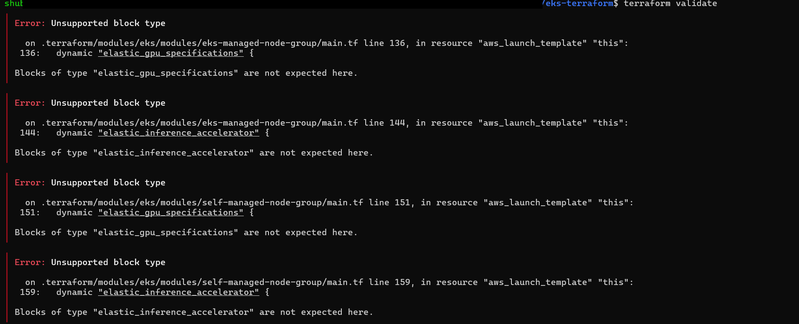
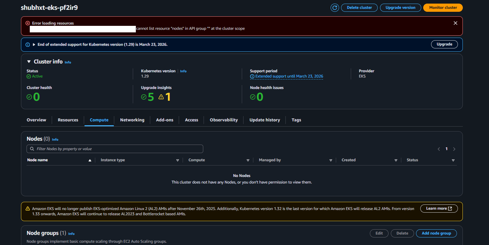

# ⚠️ Challenges & Troubleshooting – EKS with Terraform

This file documents the real-world challenges encountered during the project and how they were resolved. 
It demonstrates not only the setup but also **debugging and problem-solving skills** — valuable for interviews.

---

## 1️⃣ Terraform Validation Errors
**Issue:** 
`terraform validate` failed with errors about unsupported block types (`elastic_gpu_specifications`, `elastic_inference_accelerator`). 

**Cause:** 
Mismatch between the Terraform AWS provider version and the EKS module version. 

**Fix:** 
- Updated `versions.tf` to newer provider versions. 
- Cleaned `.terraform/` and lock files → re-ran `terraform init -upgrade`. 
- Revalidated successfully.

---

## 2️⃣ Terraform Apply Failure (Unsupported Kubernetes Version)
**Issue:** 
Cluster creation failed:
InvalidParameterException: unsupported Kubernetes version 1.27

**Cause:** 
EKS no longer supported version `1.27` for new clusters in the chosen AWS region. 

**Fix:** 
- Updated `variables.tf` to use a supported version (e.g., `1.29`). 
- Re-ran `terraform apply` → Cluster created successfully.

---

## 3️⃣ EKS Access Denied (Forbidden Errors)
**Issue:** 
After kubeconfig update, running `kubectl get nodes` returned:
Error from server (Forbidden): User "arn:aws:iam::<account>:root" cannot list resource "nodes"

**Cause:** 
EKS does not automatically grant cluster-admin rights to the root IAM user. 

**Fix:** 
- Created an **Access Entry** in the EKS console. 
- Attached `eks cluster admin policy` to root user ARN. 
- Verified with `kubectl get nodes` → success.

---

## 4️⃣ Cluster Autoscaler Pod Pending
**Issue:** 
Autoscaler pod status: `Pending` 
Events showed:

0/2 nodes are available: 1 Insufficient memory, 2 Too many pods

**Cause:** 
- Insufficient Memory.
- Node group capacity was too low for the Autoscaler pod’s resource requests. 
- Node scheduling constraints. 

**Fix:** 
- Increased node group desired size. 
- Tuned pod resource requests. 
- After fix → pod scheduled successfully.

---

## 5️⃣ Terraform State & Idempotency
**Observation (not error):** 
When `terraform apply` was interrupted, re-running picked up from the last step instead of recreating all resources. 

**Learning:** 
- Terraform ensures **idempotency** → resources are compared against state, not blindly recreated. 
- This is critical for real-world infra where downtime must be avoided.

---

## ✅ Summary
Challenges helped reinforce:
- Importance of version compatibility (Terraform modules + AWS APIs). 
- Understanding **RBAC** and IAM integration in EKS. 
- Resource requests vs. node capacity in Kubernetes. 
- Terraform’s idempotent execution as a production-strength feature. 

