# 🚀 Project Overview: Spacelift + Terraform + Ansible Orchestration

This file tracks each step of the project as we implement it, one by one.

---

## ✅ Step 1: GitHub Repository Setup
- Created new repo: **spacelift-terraform-ansible-orchestration**
- Local structure initialized with `TF/`, `ansible/`, `docs/`
- Added `.gitignore` (Terraform, Ansible, general ignores)
- Committed and pushed to GitHub main branch

---

## ✅ Step 2: Spacelift Space & Context
- Created new **Space** in Spacelift called `dev console` (under root).
- Generated fresh SSH key pair (`XT_spacelift_ansible` & `.pub`) in a safe custom folder (`~/.ssh/spacelift/`) to avoid messing with existing GitHub keys.
- Created new **Context** called `ansible-key`.
- Uploaded:
  - Private key → `/mnt/workspace/XT_spacelift_ansible`
  - Public key → `/mnt/workspace/XT_spacelift_ansible.pub`

📸 Screenshots:  
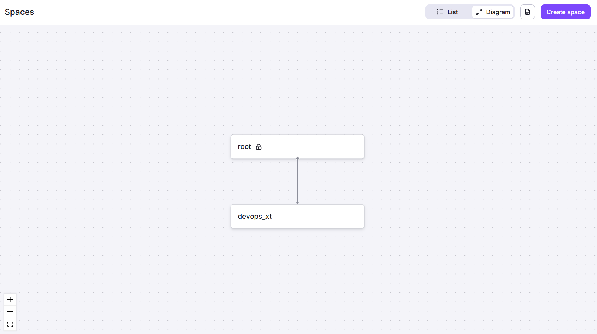  
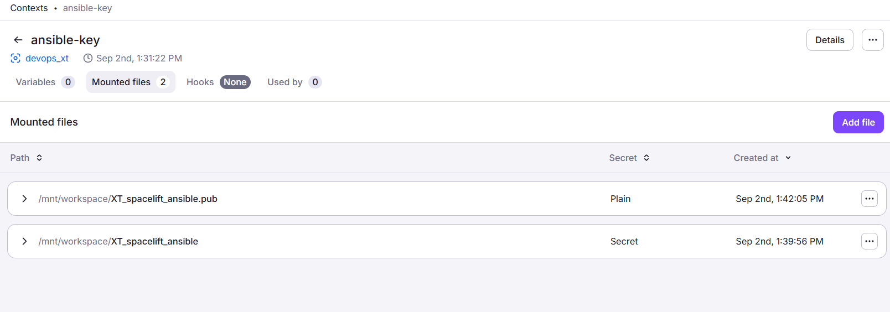

---
---

## ✅ Step 3: Terraform Stack Creation
- Created new **Terraform Stack** in Spacelift under the `dev console` space.
- Connected the GitHub repo to the stack.
- Set **Project root** to the folder containing Terraform files (`TF/`).
- Selected **Terraform** as the integration tool.
- Attached the `ansible-key` Context (for SSH public key).
- Did not yet attach cloud integration (handled in next step).

📸 Screenshot:  
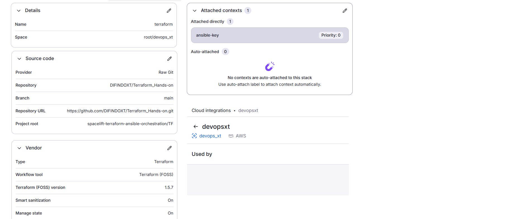

---

## ✅ Step 4: AWS Cloud Integration
- Configured AWS Cloud Integration inside Spacelift.
- Created an IAM Role in AWS with trust policy provided by Spacelift.
- Granted `AdministratorAccess` (demo only).
- Added the Role ARN back to Spacelift to finalize integration.
- Attached the AWS integration to the Terraform stack with **Read/Write** access.

---

## ✅ Step 5: Terraform Stack Run
- Triggered the Terraform stack from Spacelift.
- Terraform initialized, downloaded providers, and applied the plan.
- Successfully created **4 EC2 instances** in **eu-west-1** (Ireland).
- Verified the running instances in AWS console.

📸 Screenshot:  
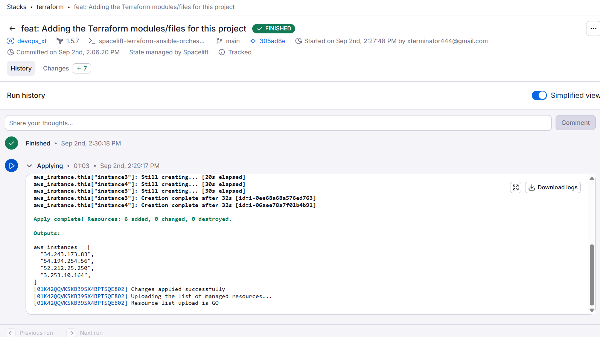
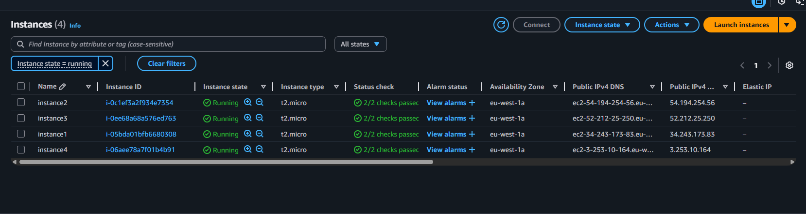
---

---

## ✅ Step 6: Ansible Stack Creation
- Created a new **Ansible Stack** inside the `dev console` space.
- Project root set to the `ansible/` folder.
- Selected **install_htop.yml** as the playbook to execute.
- Attached the `ansible-key` context (private key + public key).
- Added required environment variables:
  - `ANSIBLE_PRIVATE_KEY_FILE=/mnt/workspace/XT_spacelift_ansible`
  - `ANSIBLE_INVENTORY=/mnt/workspace/inventory.ini`
  - `ANSIBLE_REMOTE_USER=ubuntu`
- Configured dependency: mapped Terraform output `aws_instances` → Ansible input `instances`.

📸 Screenshots:  
  
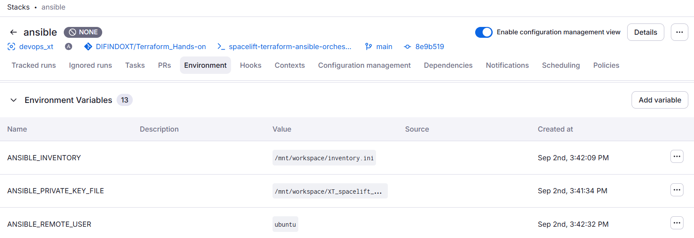  
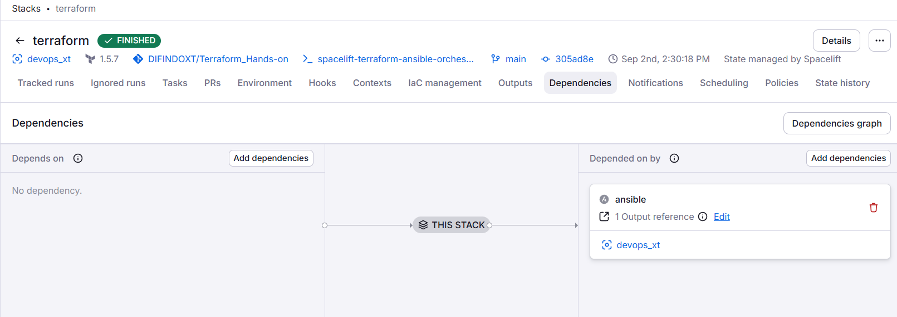

---

## ✅ Step 7: Hooks and Inventory Generation
- Added a **Before (Initialization) hook**:
  - Secured SSH key with `chmod 600`
  - Created inventory file with `[all]`
  - Populated inventory from Terraform outputs (`instances` → IPs)
- After multiple trials, finalized the correct one-liner to split IPs properly.

📸 Screenshots:  
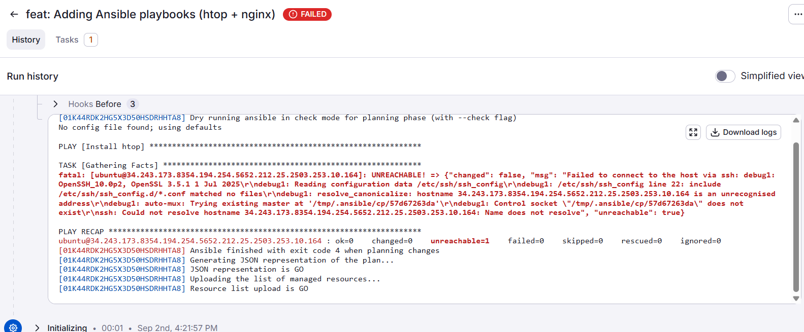  
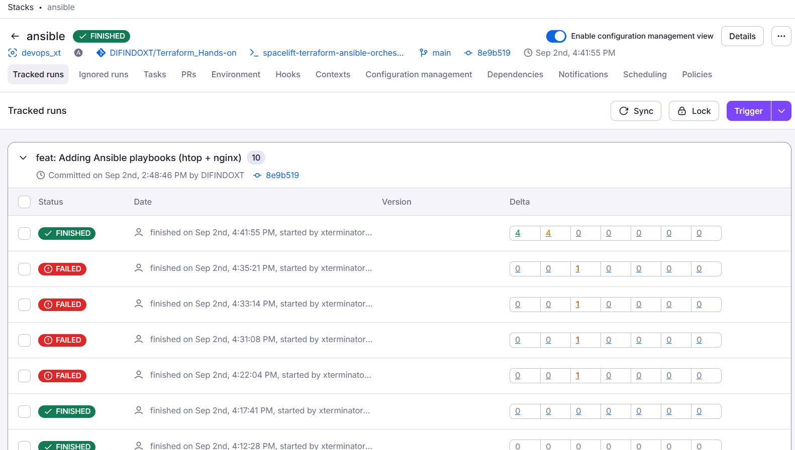

---

## ✅ Step 8: Ansible Execution
- Triggered Ansible stack → Spacelift executed playbook against all EC2s.
- Verified `htop` installation was successful on each instance.
- Connected manually via SSH to one EC2 and ran `htop` to confirm.

📸 Screenshots:  
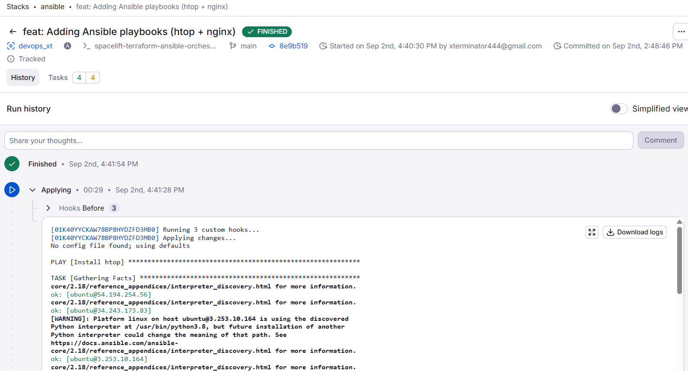  
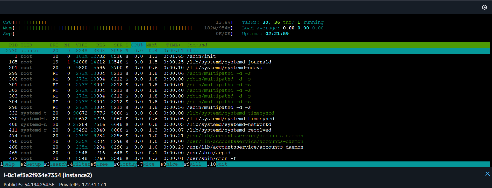

---
📸 Screenshots:
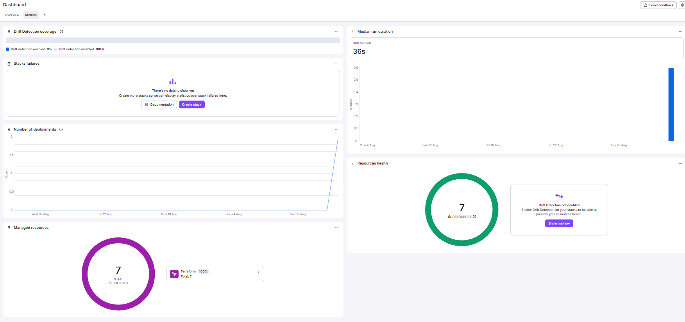

---

## Step 9 – Spacelift Integration and Ansible Automation
- Extended the stack to include **custom hooks** for Ansible.
- Terraform continued to provision EC2 instances.
- Spacelift triggered Ansible automatically after Terraform apply.
- Playbook tasks:
  - Install and configure **Nginx**
  - Deploy `index.html` with custom content
  - Ensure Nginx service is running

📸 Screenshots:

---

## Observations
- Some runs failed in planning (`--check`) mode showing:
  - `Could not find the requested service nginx: host`
  - Service not available until package fully installed
- After retries, partial success was seen:
  - One instance successfully started Nginx
  - Others showed installation complete but service missing
- Manual SSH validation confirmed:
  - Nginx packages were installed
  - Index page was created in `/var/www/html/index.html`

📸 Screenshots:
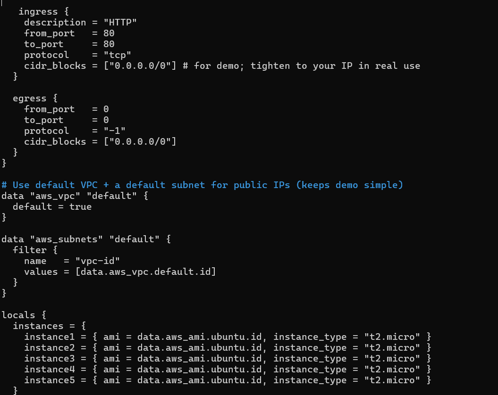

---

## Screenshots Collected
- Stack environment variables  
- Dependencies view  
- Error logs (unreachable host / nginx service not found)  
- Unstable pipeline run (passed after retries)  
- Successful run output  
- AWS Console – EC2 instances list  
- Ansible pipeline run logs  
- Manual SSH session validating Nginx installation  

---

## Final Outcome
- Infrastructure provisioning via Terraform worked as expected.
- Spacelift → Ansible integration executed but showed check-mode limitations.
- Manual install validated final Nginx setup.
- This project demonstrates **multi-tool DevOps integration** and clear documentation of both successes and failures.

📸 Screenshots:
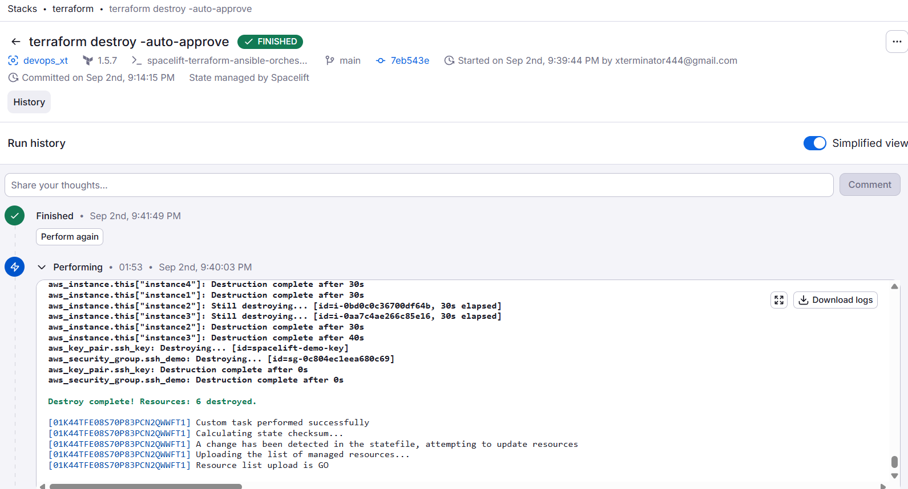
