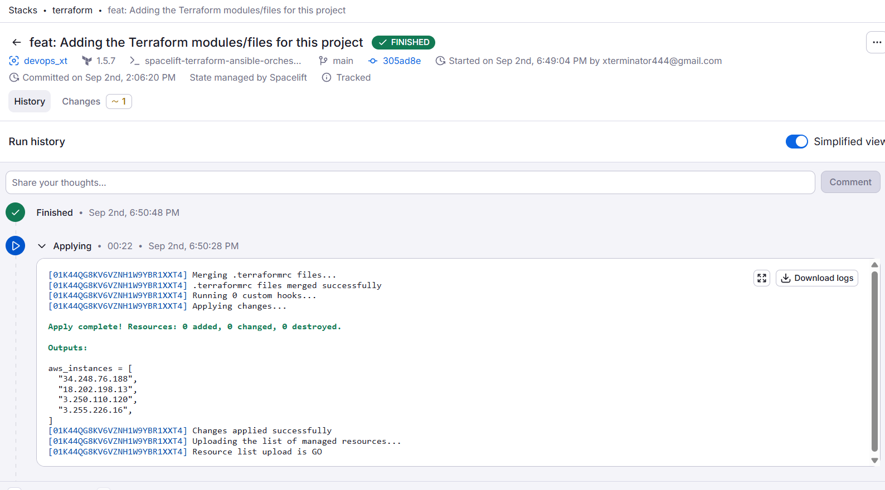
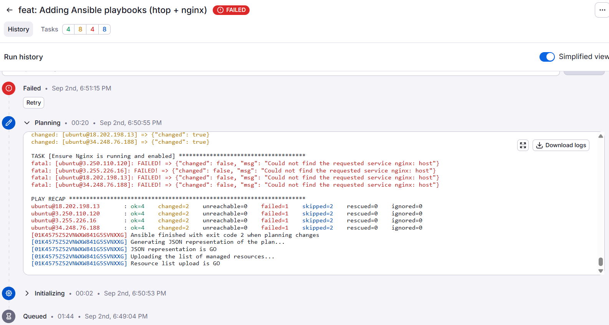

# ⚡ Challenges, Troubleshooting & Notes

This file captures small issues/confusions faced during the project.

---

## Step 1 – Spacelift Context
- Concern: reusing existing GitHub SSH keys might break account setup.  
  ✅ Solved by generating a **separate project-only key** in its own folder.
- Confusion: How to upload files in Spacelift Context.  
  ✅ Solution: Use **Mounted files → Upload → Save** (Spacelift mounts them automatically to `/mnt/workspace/`).
- Extra care: named keys uniquely (`XT_spacelift_ansible`) to avoid overwriting.

📸 Screenshot references:  


---

## Step 2–5 – Terraform Stack
- No major issues faced during stack creation or first run.
- Integration with AWS succeeded on first attempt.

---

## Step 6–8 – Ansible Stack
- ❌ Challenge: Initial runs showed *“0 custom hooks”* → fixed by placing hook in **Initialization → Before**.
- ❌ Challenge: `jq` not installed in Spacelift runner → replaced jq with shell-based parsing.
- ❌ Challenge: IP addresses got concatenated into one giant string → refined loop to split on commas properly.
- ❌ Challenge: Runs were flaky at first (took ~9–10 triggers before success). Possible cause: inventory generation order or timing.
- ✅ Solution: stabilized with correct one-liner + verified inventory contents in logs.
- ✅ Verified by connecting to EC2 and running `htop`.

📸 Screenshot references:  
  
  


---

## Step 9-10
## 1. Inventory Mismatch
- Terraform was updated to 5 instances, but only 4 showed consistently.
- Cause: stack configuration and inventory not refreshed properly.
- Lesson: Always align Terraform state, Spacelift stack settings, and Ansible inventory.
📸 Screenshot references:
  


## 2. Ansible Check Mode
- `--check` mode in planning caused errors (`nginx: host not found`).
- Service state cannot be validated until package fully installs.
- Resolution: Rerun in apply mode, validate manually, and adjust tasks with `when: not ansible_check_mode`.
📸 Screenshot references:
  


## 3. SSH & Keys
- Faced **Permission denied** issues when connecting from Windows PowerShell.
- Resolved by switching to **WSL** and using correct PEM key:
  ```bash
  ssh -i ~/.ssh/CI_CD_Key_.pem ubuntu@<public_ip>
```
